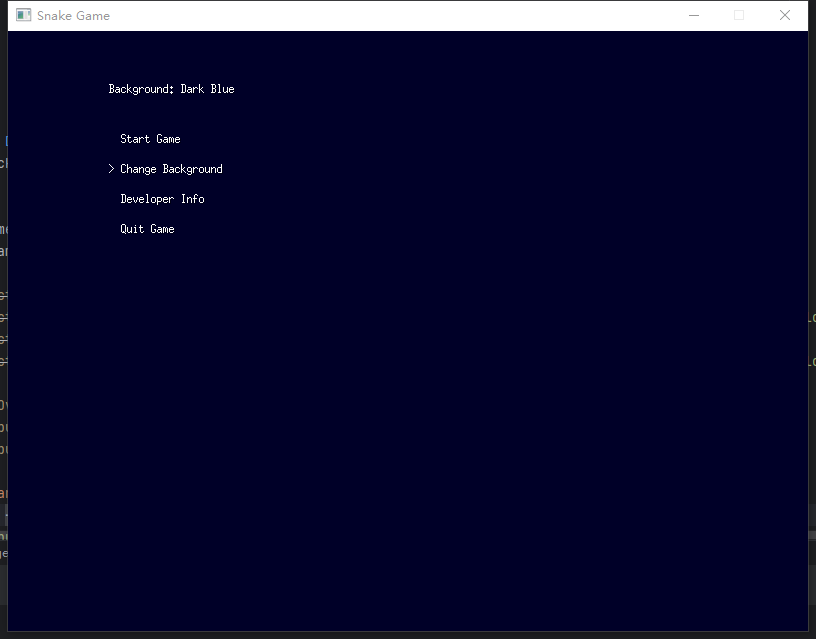
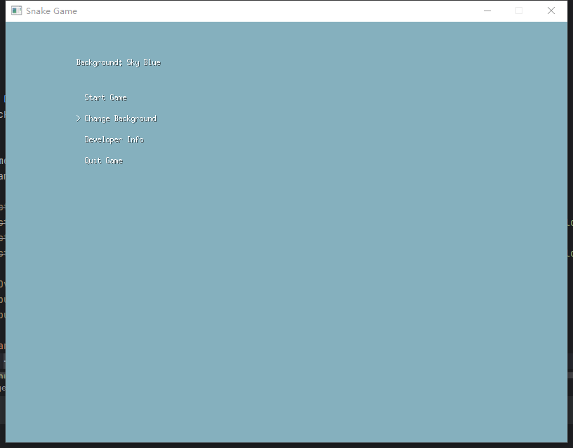
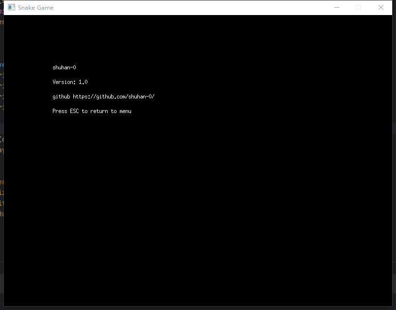
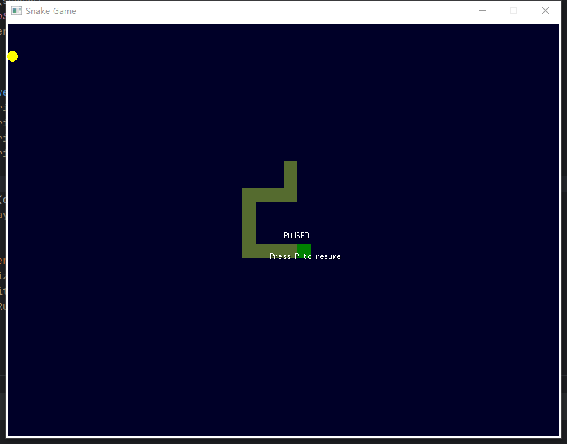

# 基于go语言的高并发分布式游戏服务器

这是一个高性能、可扩展的贪吃蛇游戏服务器实现，使用 Go 1.22 开发。

## 项目概述

本项目实现了一个分布式的游戏服务器架构，支持高并发，易于扩展。主要特点包括：

- 分离的登录网关（LoginGate）和游戏服务器（GameServer）
- 使用 Docker 容器化部署
- 服务器集群支持，实现负载均衡
- 使用 Kafka 消息队列缓存用户消息
- 使用 Goroutine 池优化并发性能
- Redis 作为 LoginGate 的缓存，减少数据库查询
- 使用 Socket 实现客户端与服务端通信
- 游戏逻辑与服务器分离，支持独立更新
- 跨平台客户端支持（Windows）

## 系统架构

1. **LoginGate**: 处理用户注册和登录，负责将用户分发到负载较低的 GameServer。
2. **GameServer**: 处理游戏逻辑，支持多实例部署。
3. **客户端**: 跨平台（Windows）支持，通过 Socket 与服务器通信。

## 技术栈

- Go 1.22
- Docker
- Kafka
- Redis
- Socket

## 项目结构
```yaml
snake-game/
│
├── cmd/
│   └── client/
│       └── main.go
├── client/
│   ├── assets/
│   │   ├── images/
│   │   └── sounds/
│   ├── network/
│   │   └── client.go
│   └── ui/
│       ├── game.go
│       ├── game_window.go
│       └── menu.go
├── docker/
│   ├── logingate/
│   │   └── Dockerfile
│   └── server/
│       └── Dockerfile
├── internal/
│   ├── game/
│   │   ├── game.go
│   │   ├── player.go
│   │   └── snake.go
│   └── network/
│       ├── connection.go
│       └── server.go
├── pkg/
│   └── config/
│       └── config.go
├── scripts/
│   ├── start_client.sh
│   └── start_servers.sh
├── go.mod
├── go.sum
snake-game/
│
├── cmd/
│   └── client/
│       └── main.go
├── client/
│   ├── assets/
│   │   ├── images/
│   │   └── sounds/
│   ├── network/
│   │   └── client.go
│   └── ui/
│       ├── game.go
│       ├── game_window.go
│       └── menu.go
├── docker/
│   ├── logingate/
│   │   └── Dockerfile
│   └── server/
│       └── Dockerfile
├── internal/
│   ├── game/
│   │   ├── game.go
│   │   ├── player.go
│   │   └── snake.go
│   └── network/
│       ├── connection.go
│       └── server.go
├── pkg/
│   └── config/
│       └── config.go
├── scripts/
│   ├── start_client.sh
│   └── start_servers.sh
├── go.mod
├── go.sum
└── config.yaml
```


## 运行说明

### 服务器端

1. 构建并启动 LoginGate:

   cd docker/logingate
   docker build -t logingate .
   docker run -d --name logingate logingate


2. 构建并启动 GameServer:

   cd docker/server
   docker build -t gameserver .
   docker run -d --name gameserver1 gameserver
3. 根据需求启动多个 GameServer 实例。

### 客户端

在 Windows 设备上运行：
go run cmd/client/main.go
## 开发说明

- 游戏逻辑位于 `internal/game/` 目录，可以独立更新而不影响服务器核心功能。
- 客户端代码位于 `client/` 目录。
- 服务器配置可以在 `config.yaml` 文件中修改。

## 注意事项

- 确保 Go 版本为 1.22 或以上。
- 我尽可能使用的是 Go 标准库，以减少第三方依赖。
- 当前游戏实现为简单的贪吃蛇，可以通过修改 `internal/game/` 目录下的文件来替换或扩展游戏逻辑。
- server、kafka和logingate的容器可能会因为启动速度产生冲突，可以手动单独启动一下（暂时还没搞清楚具体因为什么，所以还没做延迟启动）。

## 贡献

欢迎提交 Issue 或 Pull Request 来改进这个项目。

## 游戏运行界面：








